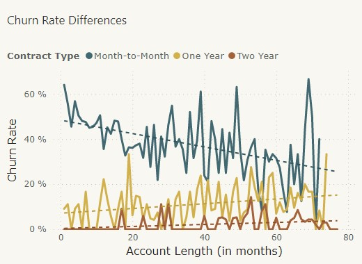
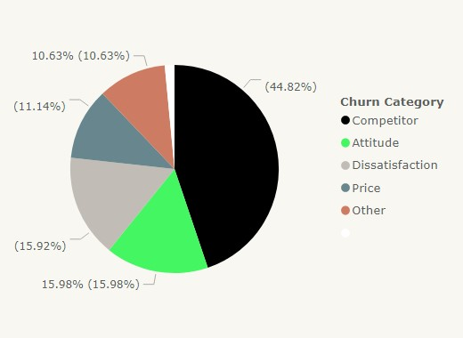

# Nicole_Portfolio
Portfolio Project for Junior Business Analyst
[Preview in PDF](https://github.com/sakiileung/Nicole_Portfolio/blob/main/proj%20preview.pdf)

# [Project 1: Churned Customer Estimator: Project Overview](https://app.powerbi.com/groups/280e3b60-7f1d-4aa7-aeb8-afcd59dd51ed/reports/d62b5161-aabb-44a7-a1b2-ad29eb586e62?ctid=0f2cb4ab-c953-45af-a925-c8886dd3fc0f&pbi_source=linkShare)
- Explore the data in Excel and perform a data check, import to Power BI.
- Figure out business questions, create measures and calculate the churn rate with DAX function
- Discover insights and visualize in different fields, build dashboard to share information
- Walk through the storytelling 

**Highlight**

- In contract type, the month-to-month contract has a higher churn rate than others. 
- But it also has a negative correlation with the account length. 

- The main reason for churned customers is competitor issue. Services attitude and customer dissatisfaction also need to focus on.

# [Project 2: Sales Insight: Project Overview](https://public.tableau.com/app/profile/nicole.leung/viz/SalesInsights_16886344911350/Dashboard2)
- This project aimed to unlock sales insights for the sales team, leading to a 10% reduction in cost and a 20% decrease in business time. 
- Deployed a star schema data model and ETL on data cleaning in Tableau, and also used mySQL for simple data analysis. 

